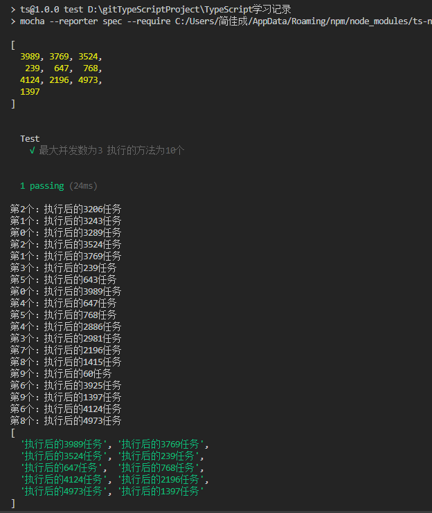
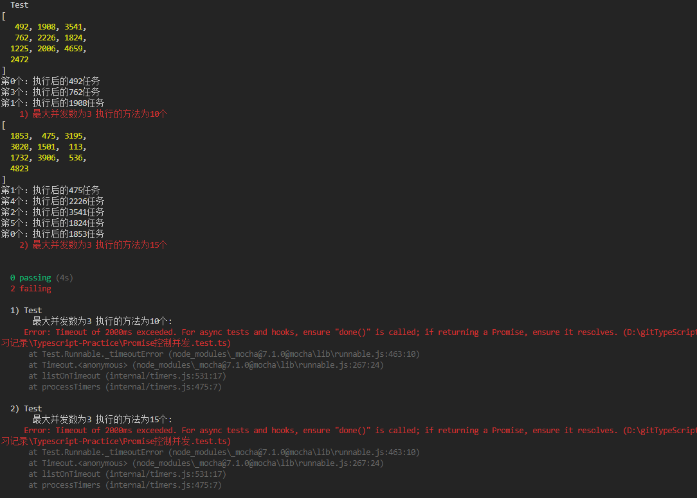
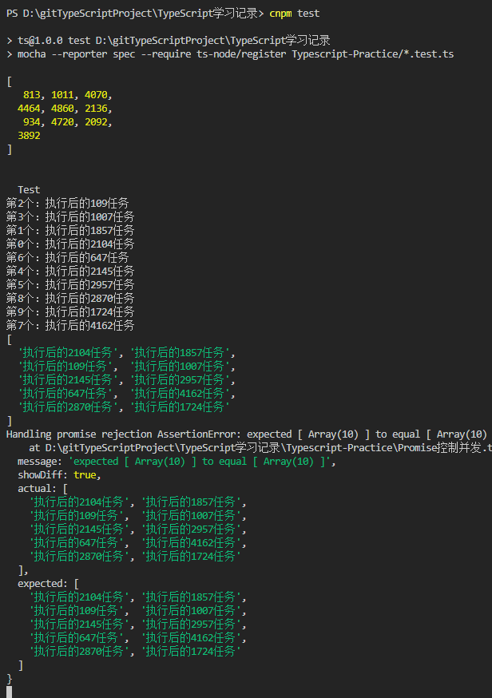
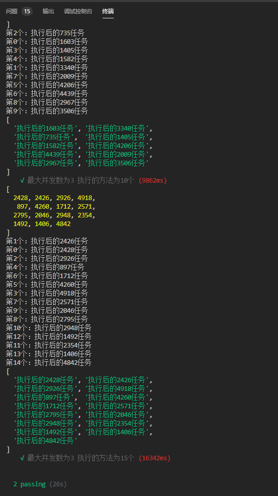

## 并发控制

假设有一系列返回 Promise 的异步任务 jobs，每个任务所需要的时间都不相同，
所有任务都一定不会失败。

请实现一个输入为 jobs 的函数 runParallel，功能是执行 jobs 中的所有异步任务，
但控制最大同时执行的任务数为 3 个。

runParallel 最终按照 jobs 数组顺序，把每个任务的返回值储存在一个数组里，
并返回这个数组（类似 Promise.all）。

```
// 1 ------------> |
// 2 ---------> |
//              3 ------> |
//                 4 ---> | resolve

*/
```

## 代码实现

思路：
- 需要两个变量来控制并发，一个用于计数，一个设定最大并发数
- 能够一直调度任务的关键是递归，入口在完成一个任务的回调里（有任务完成才有缺口剩余）
- 要能使返回的数组的顺序和任务对应需要count计数，还需要memoIndex保存索引（因为异步的原因）

注意：
- 计数（count）等于传入数组长度时任务可能还没执行完，所以还需要判断
- count在最后可能要越位
```
/**
 * @description 并发控制函数
 * @date 2020-02-28
 * @param {Array< (x: number) => Promise<string> >} jobs
 * @returns {Array<string>}
 */
function runParallel(jobs:Array< (x: number) => Promise<string> >) {
    let resValue:any = [];
    let count = 0;
    let max = 3;
    let i = 0;
    return new Promise((resolve)=>{
        function requestWork() {
            // count==jobs.length时，可能还有任务还在执行，当i==0任务肯定都执行完了
            if (count >= jobs.length && i===0){
                resolve(resValue)
            }
            // count在最后的时候有可能越位需要判断
            while (i < max && count<jobs.length) {
              i++;
              // 拷贝一份到作用域链 不然异步的回来在修改count已经变了
              const memoIndex = count;
              jobs[memoIndex](i).then(res => {
                resValue[memoIndex] = res;
                i--;
                console.log('第'+memoIndex+'个：'+res)
                requestWork()
              });
              count++;
            }
          }
          requestWork()
    })
  }
```

## 单元测试 TS

### 测试环境配置

- mocha 运行测试的工具
- chai 提供断言支持
- ts-node 让 mocha 支持 Ts

### 配置指令

```
  "scripts": {
    "test": "mocha --reporter spec --require ts-node/register Typescript-Practice/*.test.ts"
  },
```

### 测试结果1



问题

为什么这个先打出来，后面都还在跑就说成功了，感觉测试写的还是有点小问题

```
    Test
    √ 最大并发数为3 执行的方法为10个
```

分析mocha默认不支持异步，与要设置done参数来等待执行

### 测试结果2



分析mocha默认超时时间2000ms太短了。。

### 测试结果3

设置一个大的超时时间`this.timeout(1000000);`发现还是有问题


分析进入了catch函数代表expect断言抛错了，比较结果为不相等，可能只是进行了浅比较，数组的栈内存肯定不相等，得加深比较


### 最终测试结果

添加深比较，再次判断


