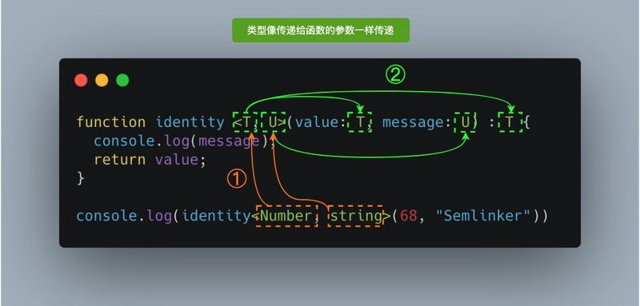

## ! 非空断言操作符

在上下文中当类型检查器无法断定类型时，一个新的后缀表达式操作符 ! 可以用于断言操作对象是非 null 和非 undefined 类型。具体而言，x! 将从 x 值域中排除 null 和 undefined 。

## ?. 运算符

TypeScript 3.7 实现了呼声最高的 ECMAScript 功能之一：可选链（Optional Chaining）。有了可选链后，我们编写代码时如果遇到 null 或 undefined 就可以立即停止某些表达式的运行。可选链的核心是新的 ?. 运算符，它支持以下语法：

```
obj?.prop // 可选属性的访问
obj?.[expr]
arr?.[index] // 可选元素访问
func?.(args) // 可选链与函数调用
```

为了更好的理解可选链，我们来看一下该 const val = a?.b 语句编译生成的 ES5 代码：

```
var val = a === null || a === void 0 ? void 0 : a.b;
```

**?. 与 && 运算符行为略有不同，&& 专门用于检测 falsy 值，比如空字符串、0、NaN、null 和 false 等。而 ?. 只会验证对象是否为 null 或 undefined，对于 0 或空字符串来说，并不会出现 “短路”。**

## ?? 空值合并运算符

在 TypeScript 3.7 版本中除了引入了前面介绍的可选链 ?. 之外，也引入了一个新的逻辑运算符 —— 空值合并运算符 ??。当左侧操作数为 null 或 undefined 时，其返回右侧的操作数，否则返回左侧的操作数。

**与逻辑或 || 运算符不同，逻辑或会在左操作数为 falsy 值时返回右侧操作数。也就是说，如果你使用 || 来为某些变量设置默认的值时，你可能会遇到意料之外的行为。比如为 falsy 值（''、NaN 或 0）时。**

```
const foo = null ?? 'default string';
console.log(foo); // 输出："default string"

const baz = 0 ?? 42;
console.log(baz); // 输出：0
```

以上 TS 代码经过编译后，会生成以下 ES5 代码：

```
"use strict";
var _a, _b;
var foo = (_a = null) !== null && _a !== void 0 ? _a : 'default string';
console.log(foo); // 输出："default string"

var baz = (_b = 0) !== null && _b !== void 0 ? _b : 42;
console.log(baz); // 输出：0
```

### 短路

当空值合并运算符的左表达式不为 null 或 undefined 时，不会对右表达式进行求值。

```
function A() { console.log('A was called'); return undefined;}
function B() { console.log('B was called'); return false;}
function C() { console.log('C was called'); return "foo";}

console.log(A() ?? C());
console.log(B() ?? C());

A was called
C was called
foo
B was called
false
```

### 不能与 && 或 || 操作符共用

若空值合并运算符 ?? 直接与 AND（&&）和 OR（||）操作符组合使用 ?? 是不行的。这种情况下会抛出 SyntaxError。

```
// '||' and '??' operations cannot be mixed without parentheses.(5076)
null || undefined ?? "foo"; // raises a SyntaxError

// '&&' and '??' operations cannot be mixed without parentheses.(5076)
true && undefined ?? "foo"; // raises a SyntaxError
```

但当使用括号来显式表明优先级时是可行的，比如：

```
(null || undefined ) ?? "foo"; // 返回 "foo"
```

## ?: 可选属性

可以把某个属性声明为可选的：

```
interface Person {
  name: string;
  age?: number;
}

let lolo: Person  = {
  name: "lolo"
}
```

## & 运算符

在 TypeScript 中交叉类型是将多个类型合并为一个类型。通过 & 运算符可以将现有的多种类型叠加到一起成为一种类型，它包含了所需的所有类型的特性。

```
type PartialPointX = { x: number; };
type Point = PartialPointX & { y: number; };

let point: Point = {
  x: 1,
  y: 1
}
```

### 同名基础类型属性的合并

```
interface X {
  c: string;
  d: string;
}

interface Y {
  c: number;
  e: string
}

type XY = X & Y;
type YX = Y & X;

let p: XY;
let q: YX;
```

成员 c 的类型为 string & number，即成员 c 的类型既可以是 string 类型又可以是 number 类型。很明显这种类型是不存在的，所以混入后成员 c 的类型为 never。

### 同名非基础类型属性的合并

```
interface D { d: boolean; }
interface E { e: string; }
interface F { f: number; }

interface A { x: D; }
interface B { x: E; }
interface C { x: F; }

type ABC = A & B & C;

let abc: ABC = {
  x: {
    d: true,
    e: 'semlinker',
    f: 666
  }
};

console.log('abc:', abc);
```

，在混入多个类型时，若存在相同的成员，且成员类型为非基本数据类型，那么是可以成功合并。

## | 分隔符

在 TypeScript 中联合类型（Union Types）表示取值可以为多种类型中的一种，联合类型使用 | 分隔每个类型。联合类型通常与 null 或 undefined 一起使用：

```
let num: 1 | 2 = 1;
type EventNames = 'click' | 'scroll' | 'mousemove';
```

## <Type> 语法

### 泛型

对于刚接触 TypeScript 泛型的读者来说，首次看到` <T>` 语法会感到陌生。其实它没有什么特别，就像传递参数一样，我们传递了我们想要用于特定函数调用的类型。

其中 T 代表 Type，在定义泛型时通常用作第一个类型变量名称。但实际上 T 可以用任何有效名称代替。除了 T 之外，以下是常见泛型变量代表的意思：

- K（Key）：表示对象中的键类型；
- V（Value）：表示对象中的值类型；
- E（Element）：表示元素类型。



### 断言

通过类型断言这种方式可以告诉编译器，“相信我，我知道自己在干什么”。类型断言好比其他语言里的类型转换，但是不进行特殊的数据检查和解构。它没有运行时的影响，只是在编译阶段起作用。

```
let someValue: any = "this is a string";
let strLength: number = (<string>someValue).length;
```

as 语法

```
let someValue: any = "this is a string";
let strLength: number = (someValue as string).length;

```

## @XXX 装饰器

装饰器的本质是一个函数，通过装饰器我们可以方便地定义与对象相关的元数据。

```
@Plugin({
  pluginName: 'Device',
  plugin: 'cordova-plugin-device',
  pluginRef: 'device',
  repo: 'https://github.com/apache/cordova-plugin-device',
  platforms: ['Android', 'Browser', 'iOS', 'macOS', 'Windows'],
})
@Injectable()
export class Device extends IonicNativePlugin {}
```

看一下编译生成的 ES5 代码：

```
var __decorate = (this && this.__decorate) || function (decorators, 装饰器
, key, desc) {
    var c = arguments.length, r = c < 3 ? target : desc === null ? desc = Object.getOwnPropertyDescriptor(target, key) : desc, d;
    if (typeof Reflect === "object" && typeof Reflect.decorate === "function") r = Reflect.decorate(decorators, target, key, desc);
    else for (var i = decorators.length - 1; i >= 0; i--) if (d = decorators[i]) r = (c < 3 ? d(r) : c > 3 ? d(target, key, r) : d(target, key)) || r;
    return c > 3 && r && Object.defineProperty(target, key, r), r;
};

var Device = /** @class */ (function (_super) {
    __extends(Device, _super);
    function Device() {
        return _super !== null && _super.apply(this, arguments) || this;
    }
    Device = __decorate([
        Plugin({
            pluginName: 'Device',
            plugin: 'cordova-plugin-device',
            pluginRef: 'device',
            repo: 'https://github.com/apache/cordova-plugin-device',
            platforms: ['Android', 'Browser', 'iOS', 'macOS', 'Windows'],
        }),
        Injectable()
    ], Device);
    return Device;
}(IonicNativePlugin));

```

通过生成的代码可知，@Plugin({...}) 和 @Injectable() 最终会被转换成普通的方法调用，它们的调用结果最终会以数组的形式作为参数传递给 **decorate 函数，而在 **decorate 函数内部会以 Device 类作为参数调用各自的类型装饰器，从而扩展对应的功能。

## #XXX 私有字段

```
class Person {
  #name: string;

  constructor(name: string) {
    this.#name = name;
  }

  greet() {
    console.log(`Hello, my name is ${this.#name}!`);
  }
}

let semlinker = new Person("Semlinker");

semlinker.#name;
//     ~~~~~
// Property '#name' is not accessible outside class 'Person'
// because it has a private identifier.
```

与常规属性（甚至使用 private 修饰符声明的属性）不同，私有字段要牢记以下规则：

- 私有字段以 # 字符开头，有时我们称之为私有名称；
- 每个私有字段名称都唯一地限定于其包含的类；
- 不能在私有字段上使用 TypeScript 可访问性修饰符（如 public 或 private）；
- 私有字段不能在包含的类之外访问，甚至不能被检测到。

## is 关键字

is 关键字一般用于函数返回值类型中，判断参数是否属于某一类型，并根据结果返回对应的布尔类型。

首先在一个判断函数类型的方法中，没用 is 会触发编译错误，因为类型是 unknown，无法进行下一步操作。

isString() 函数确认参数 x 为 string 类型，但是由于函数嵌套 TypeScript 不能进行正确的类型判断。

```TS
function isString(s: unknown): boolean {
  return typeof s === 'string'
}

function toUpperCase(x: unknown) {
  if(isString(x)) {
    x.toUpperCase() // Error, Object is of type 'unknown'
  }
}
```

这时，就可以使用 is 关键字：

```TS
const isString = (s: unknown): s is string => typeof val === 'string'

function toUpperCase(x: unknown) {
  if(isString(x)) {
    x.toUpperCase()
  }
}
```

下面是一些常用的类型判断函数:

```TS
const isNumber = (val: unknown): val is number => typeof val === 'number'
const isString = (val: unknown): val is string => typeof val === 'string'
const isSymbol = (val: unknown): val is symbol => typeof val === 'symbol'
const isFunction = (val: unknown): val is Function => typeof val === 'function'
const isObject = (val: unknown): val is Record<any, any> => val !== null &amp;&amp; typeof val === 'object'

function isPromise<T = any>(val: unknown): val is Promise<T> {
  return isObject(val) &amp;&amp; isFunction(val.then) &amp;&amp; isFunction(val.catch)
}

const objectToString = Object.prototype.toString
const toTypeString = (value: unknown): string => objectToString.call(value)
const isPlainObject = (val: unknown): val is object => toTypeString(val) === '[object Object]'
```

## extends

### 继承

接口继承，类继承都使用extends,可以多继承。

### 泛型约束

对传入泛型有哪些类型进行约束也使用extends。

在函数内部使用泛型变量的时候，由于事先不知道它是哪种类型，所以不能随意的操作它的属性或方法：

```TS
function loggingIdentity<T>(arg: T): T {
    console.log(arg.length);
    return arg;
}

// index.ts(2,19): error TS2339: Property 'length' does not exist on type 'T'.

```
泛型 T 不一定包含属性 length，所以编译的时候报错了。

可以对泛型进行约束，只允许这个函数传入那些包含 length 属性的变量。这就是泛型约束：

```TS
interface Lengthwise {
    length: number;
}

function loggingIdentity<T extends Lengthwise>(arg: T): T {
    console.log(arg.length);
    return arg;
}

```

### 条件类型

>大多数的Utility type使用了extends来实现

extends 运用在 type 和 class 和接口 中时完全是两种作用的效果。条件类型是一种条件表达式进行类型的关系检测。

```
type A = 'x';
type B = 'x' | 'y';

type Y = A extends B ? true : false; // true
上面的类型意思是，若A能够赋值给B，那么类型是A，否则为B。

```

## 泛型工具类关键字

in keyOf infer typeof 在泛型那里总结了

## typeof

```TS
interface Person {
  name: string;
  age: number;
}

const sem: Person = { name: 'semlinker', age: 33 };
type Sem= typeof sem; // -> Person

function toArray(x: number): Array<number> {
  return [x];
}

type Func = typeof toArray; // -> (x: number) => number[]

```

## keyof

操作符可以用于获取某种类型的所有键，其返回类型是联合类型。
```
interface Person {
  name: string;
  age: number;
}

type K1 = keyof Person; // "name" | "age"
type K2 = keyof Person[]; // "length" | "toString" | "pop" | "push" | "concat" | "join" 
type K3 = keyof { [x: string]: Person };  // string | number

```

## in

in 用来遍历枚举类型
```
type Keys = "a" | "b" | "c"

type Obj =  {
  [p in Keys]: any
} // -> { a: any, b: any, c: any }

```

## infer


>https://segmentfault.com/a/1190000018514540?utm_source=tag-newest

**语句 let num 中，通过 let 来声明了一个变量，那怎样声明一个不确定的类型变量呢？ 答案是使用 infer 关键字，infer R 就是声明了一个类型变量 R。**

在extends语句中，还支持infer关键字，可以推断一个类型变量，高效的对类型进行模式匹配。但是，这个类型变量只能在true的分支中使用。

infer X 就相当于声明了一个变量，这个变量随后可以使用，在extends里用于去匹配赋值的类型。


infer 最早出现在此 PR 中，表示在 extends 条件语句中待推断的类型变量。


```TS
// infer P 表示待推断的函数参数。
type ParamType<T> = T extends (param: infer P) => any ? P : T;

```
如果 T 能赋值给 (param: infer P) => any，则结果是 (param: infer P) => any 类型中的参数 P，否则返回为 T。


```
interface User {
  name: string;
  age: number;
}

type Func = (user: User) => void

type Param = ParamType<Func>;   // Param = User
type AA = ParamType<string>;    // string

```

内置类型ReturnType就是用infer实现的

```
type ReturnType<T> = T extends (...args: any[]) => infer P ? P : any;
// 如果 T 能够赋值给 (...args: any) => infer R，则返回类型为 R，否则为 any 类型。
```

`ReturnType<T>` 只是将 infer P 从参数位置移动到返回值位置，因此此时 P 即是表示待推断的返回值类型。

```
type Func = () => User;
type Test = ReturnType<Func>;   // Test = User

```

## 参考文章

- https://segmentfault.com/a/1190000023943952
